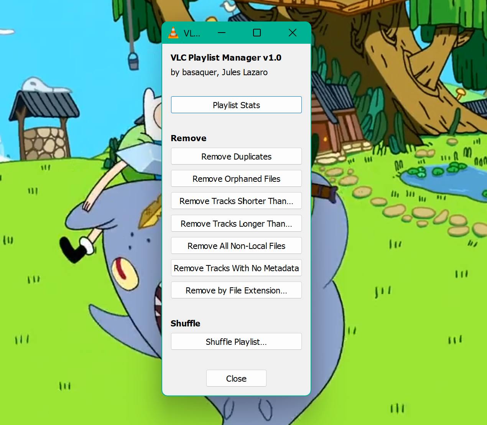
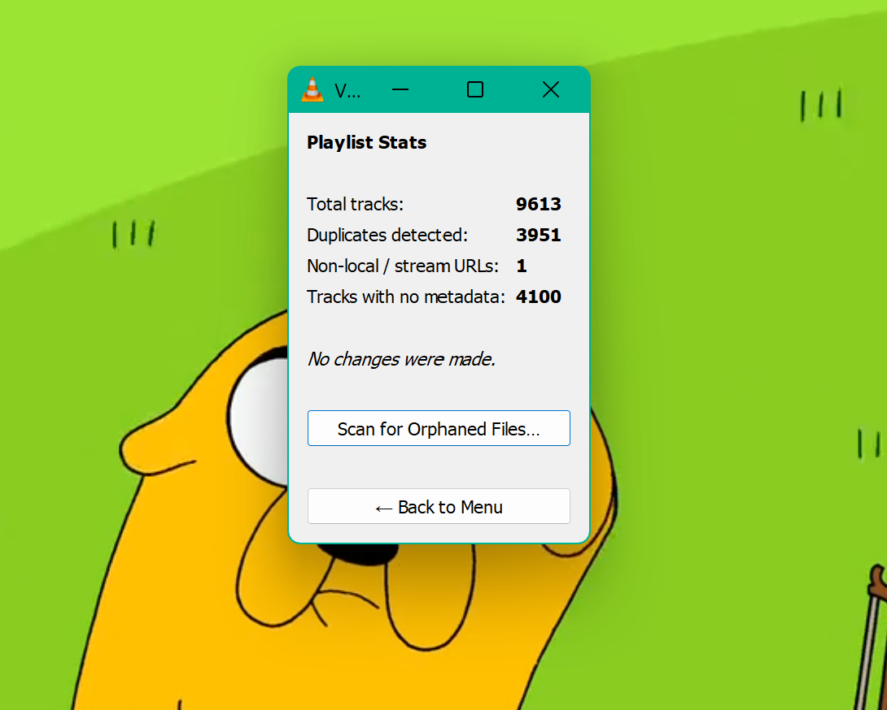
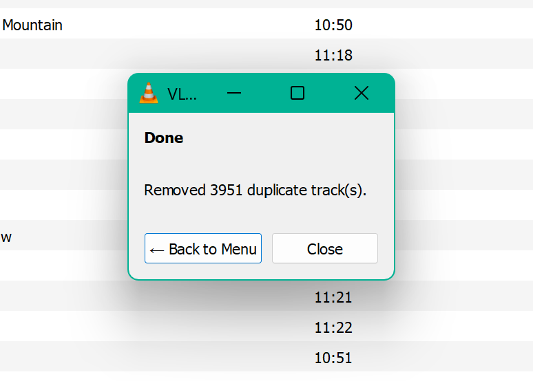

# VLC Playlist Manager

**A modern, fully rewritten VLC extension for managing large playlists, including removal of duplicates and orphan files.**

By basaquer (original) and Jules Lazaro (rewrite)

---

  
  
  

## Features

### Playlist Stats
A fast, non-destructive scan of your playlist that instantly reports:
- Total track count
- Duplicate tracks detected
- Non-local / stream URLs
- Tracks with no metadata (untagged files)

Orphan file scanning is available as a separate opt-in scan with an upfront warning, since it requires checking every file on disk and can take time on large playlists.

### Remove Duplicates
Scans for tracks with identical file paths and removes all but the first occurrence, preserving playlist order.

### Remove Orphaned Files
Checks every local file in the playlist against the filesystem and removes entries where the file no longer exists. Skips network items and streams. Correctly handles permission-denied errors — a file that exists but isn't readable will not be removed.

> ⚠️ On large playlists this operation checks every file on disk one by one. VLC will appear frozen during the scan. This is expected — Lua extensions are single-threaded. A warning is shown before the scan begins.

### Remove Tracks Shorter / Longer Than
Set a duration threshold in seconds, minutes, or hours. Tracks with known durations outside that range are removed. Tracks with no duration data (unscanned files, some streams) are safely skipped.

### Remove All Non-Local Files
One-click removal of everything in the playlist that isn't a local file — HTTP streams, RTSP feeds, network shares, YouTube URLs, and so on. Useful for enforcing a local-only playlist.

### Remove Tracks With No Metadata
Removes tracks where VLC has no title tag and is falling back to the raw filename as the display name. Useful for cleaning up bulk-imported playlists where many files are untagged.

### Remove by File Extension
Auto-populates a dropdown with every file extension currently present in the playlist. Select one and remove all matching tracks. Useful for removing `.flv`, `.wma`, or other formats you no longer want.

### Shuffle Playlist
Four shuffle algorithms to choose from:

| Algorithm | Description |
|---|---|
| **Fisher-Yates** | True uniform random shuffle. Every permutation is equally likely. The gold standard for shuffling. |
| **Weighted by Duration** | Shorter tracks are probabilistically placed earlier. Produces more varied listening by avoiding long tracks clustering together at the start. |
| **Interleaved by Folder** | Groups tracks by their parent folder (a good proxy for artist if your library is organized that way), then round-robins across groups. Prevents the same artist from playing in long runs. |
| **Seeded Shuffle** | Deterministic Fisher-Yates using a user-supplied integer seed. The same seed always produces the same order — useful for sharing a "random" playlist that's actually reproducible. |

> ⚠️ Shuffle rebuilds the playlist by deleting all items and re-adding them in the new order. This is the only way to reorder in VLC's Lua API. A warning is shown before the operation begins.

---

## Background

If you've ever gone looking for a way to clean up your VLC playlist, you've probably found the original **Playlist Cleaner** by *basaquer*, posted to the VideoLAN addons site around 2011. For years it was the go-to solution — a small Lua script that could remove duplicate and orphaned tracks from a playlist. Simple, useful, and at the time, it worked.

By modern standards the original script is effectively broken. It crashes on Linux and macOS due to incorrect path handling, deletes HTTP streams and network items it was never supposed to touch, hangs indefinitely on large playlists, corrupts its results by modifying the playlist while iterating over it, and leaks global state between activations. The original author hasn't been reachable for years and the addon page has long since gone stale.

**VLC Playlist Manager** is a complete rewrite from the ground up. It preserves the spirit of the original — a lightweight Lua extension, no external dependencies, runs inside VLC itself — while modernizing the code, fixing every known bug, and expanding the feature set significantly.

---

## What's Fixed from the Original

The original Playlist Cleaner had several serious bugs that made it unreliable or outright broken depending on your setup:

- **Linux and macOS path handling was broken.** The original stripped `file:///` from URIs, which accidentally removed the leading `/` from Unix paths, turning `/home/user/music/song.mp3` into `home/user/music/song.mp3`. Every orphan check then failed silently and no files were ever correctly identified.

- **HTTP streams, RTSP feeds, and network URLs were treated as orphaned files.** Any non-local item in the playlist — a web radio station, a YouTube URL, anything without a file path — would be flagged as a missing file and deleted.

- **The orphan check never explicitly returned `true`.** A Lua nil return was being compared against `false`, which masked the bug but produced unreliable results. Files that existed but were unreadable (permission denied) were also incorrectly flagged as orphaned and removed.

- **The playlist was mutated during iteration.** Deleting items inside a `pairs()` loop is undefined behavior in Lua — items get skipped or processed twice. The rewrite collects all IDs to delete first, then deletes after the loop.

- **Global variable leaks** meant that state from one activation could bleed into the next, causing erratic behavior if the extension was deactivated and re-opened.

- **Playing back a file being removed caused a hard hang** requiring a force-quit. The rewrite stops playback before any removal operation.

---

## Installation

1. Download `playlist.lua`
2. Copy it into your VLC extensions folder:
   - **Windows:** `%APPDATA%\vlc\lua\extensions\`
   - **macOS:** `~/Library/Application Support/org.videolan.vlc/lua/extensions/`
   - **Linux:** `~/.local/share/vlc/lua/extensions/`
3. Restart VLC
4. Open the extension from the menu: **View → VLC Playlist Manager**

If the extensions folder doesn't exist, create it.

---

## Compatibility

Tested on VLC 3.x. Should work on any platform VLC supports (Windows, macOS, Linux). The path handling is platform-aware and correctly handles both Windows drive-letter paths and Unix absolute paths.

---

## A Note on Large Playlists

VLC's Lua extension API is single-threaded with no async support. Any operation that touches the filesystem — orphan checking, shuffle rebuild — blocks VLC's UI thread for the duration. On a playlist of several thousand tracks this can mean anywhere from a few seconds to a couple of minutes depending on your storage hardware.

**This is a VLC API limitation, not a bug in this extension.** Every operation that has this characteristic displays a warning screen before it runs so you know what to expect.

---

## Technical Notes for Developers

The extension uses a **single persistent dialog** that never gets destroyed. Instead of spawning new `vlc.dialog()` windows for each screen (which causes focus issues and windows hiding behind VLC), all widget handles are tracked in a table and cleared between screens using `del_widget`. This is the most reliable pattern for multi-screen VLC Lua extensions.

The seeded shuffle uses a **linear congruential generator** with Numerical Recipes parameters (`a=1664525`, `c=1013904223`, `m=2^32`) rather than `math.random` with a seed, because VLC's Lua environment doesn't guarantee consistent `math.random` behavior across platforms when seeded.

URI decoding uses a standard `%xx` hex decode and is platform-aware for the `file://` → filesystem path conversion.

---

## License

MIT License. See [LICENSE](LICENSE) for full text.

Original work © basaquer  
Modified work © Jules Lazaro

---

## Acknowledgements

Thanks to **basaquer** for the original Playlist Cleaner, which served the VLC community well for many years and provided the foundation and motivation for this rewrite.
